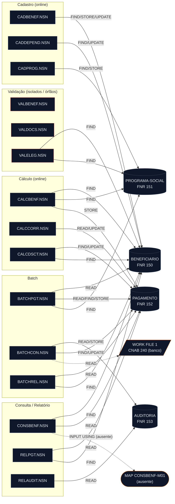

<!-- markdownlint-disable MD013 MD025 MD026 MD028 MD029 MD033 MD034 MD040 MD051 MD060 -->

# Mapa de Dependências — SIFAP Legado

  

> 🗺 **Você está aqui:** [Kit PT-BR](../README.md) → [Estágio 1](README.md) → **dependency-map**

> **Para quem é isto?** Este é um **artefato preenchido pelo time** durante o Estágio 1 (Arqueologia).
>
> **O que você terá ao final do estágio:**
>
> 1. Este documento totalmente preenchido com os dados reais do legado SIFAP
> 2. Rastreabilidade para `01-arqueologia/legado-sifap/` (programas `.NSN` e DDMs)
> 3. Base de evidência usada nas EARS do Estágio 2 (`source_legacy:`)
>
> 📘 **Guia passo a passo:** [`GUIDE.md`](GUIDE.md).

> **Escopo analisado:** todos os 15 programas `.NSN` em [`legado-sifap/natural-programs/`](legado-sifap/natural-programs/), recursivo, + os 4 DDMs em [`legado-sifap/adabas-ddms/`](legado-sifap/adabas-ddms/).
> **Método:** rastreio de `CALLNAT`, `INCLUDE`, `PERFORM` e instruções de acesso a dados (`READ`/`FIND`/`GET`/`STORE`/`UPDATE`/`DELETE`/`HISTOGRAM`) diretamente no código-fonte. Cada aresta cita `arquivo:linha`. Nenhuma conexão foi inferida sem evidência.
> **Data:** 2026-06-10 · gerado por `@archaeologist` (`/map-dependencies`).

## ⚠️ Achado central — o grafo programa→programa está VAZIO

Não existe **uma única** instrução `CALLNAT` nem `INCLUDE` em nenhum dos 15 programas. Confirmado por busca em todo o diretório (0 ocorrências de `CALLNAT`, `INCLUDE` e `FETCH`).

Consequências:

- **Não há arestas programa→programa.** Os nomes de família (`CALC*`, `VAL*`) sugerem modularidade que **não existe** em tempo de execução. Cada `.NSN` é um silo compilado isoladamente.
- **Todo acoplamento é indireto, via arquivos Adabas compartilhados** (stamp coupling sobre `BENEFICIARIO`, `PAGAMENTO`, `PROGRAMA-SOCIAL`, `AUDITORIA`). Para saber "quem afeta quem", siga o dado, não a chamada.
- **Lógica é duplicada, não reutilizada.** [`BATCHPGT.NSN`](legado-sifap/natural-programs/BATCHPGT.NSN) recalcula o benefício inline (cabeçalho diz "CHAMA CALCBENF E CALCDSCT", mas não há `CALLNAT`); [`CALCBENF.NSN`](legado-sifap/natural-programs/CALCBENF.NSN) reimplementa uma versão simplificada do desconto em vez de usar [`CALCDSCT.NSN`](legado-sifap/natural-programs/CALCDSCT.NSN). Os validadores `VAL*` não são invocados por ninguém.

## Diagrama Mermaid

> Fonte canônica: [`dependency-map.mmd`](dependency-map.mmd). Réplica abaixo. Retângulos = programas; cilindros = arquivos Adabas; traço = referência externa/ausente.

## Arestas Programa-para-Programa

| Origem | Alvo | Tipo | Arquivo | Linha |
| ------ | ---- | ---- | ------- | ----- |
| — | — | `CALLNAT` | — | **Nenhuma.** 0 ocorrências de `CALLNAT` no diretório. |
| — | — | `INCLUDE` | — | **Nenhuma.** 0 ocorrências de `INCLUDE` no diretório. |

> Não há grafo de chamadas inter-programa. Ver "Achado central" acima.

## Arestas Programa-para-Dados

Cada linha = uma instrução de acesso real no código. `op` distingue `READ`, `FIND`, `STORE`, `UPDATE`.

| Programa | DDM/Arquivo | Operação | Arquivo | Linha |
| -------- | ----------- | -------- | ------- | ----- |
| BATCHPGT | PAGAMENTO | READ | [BATCHPGT.NSN](legado-sifap/natural-programs/BATCHPGT.NSN#L171) | 171 |
| BATCHPGT | BENEFICIARIO | READ | [BATCHPGT.NSN](legado-sifap/natural-programs/BATCHPGT.NSN#L182) | 182 |
| BATCHPGT | PAGAMENTO | FIND | [BATCHPGT.NSN](legado-sifap/natural-programs/BATCHPGT.NSN#L202) | 202 |
| BATCHPGT | PROGRAMA-SOCIAL | FIND | [BATCHPGT.NSN](legado-sifap/natural-programs/BATCHPGT.NSN#L214) | 214 |
| BATCHPGT | PAGAMENTO | STORE | [BATCHPGT.NSN](legado-sifap/natural-programs/BATCHPGT.NSN#L335) | 335 |
| BATCHCON | AUDITORIA | READ | [BATCHCON.NSN](legado-sifap/natural-programs/BATCHCON.NSN#L88) | 88 |
| BATCHCON | WORK FILE 1 (CNAB, externo) | READ | [BATCHCON.NSN](legado-sifap/natural-programs/BATCHCON.NSN#L106) | 106 |
| BATCHCON | PAGAMENTO | FIND | [BATCHCON.NSN](legado-sifap/natural-programs/BATCHCON.NSN#L139) | 139 |
| BATCHCON | PAGAMENTO | FIND | [BATCHCON.NSN](legado-sifap/natural-programs/BATCHCON.NSN#L173) | 173 |
| BATCHCON | PAGAMENTO | UPDATE | [BATCHCON.NSN](legado-sifap/natural-programs/BATCHCON.NSN#L178) | 178 |
| BATCHCON | PAGAMENTO | FIND | [BATCHCON.NSN](legado-sifap/natural-programs/BATCHCON.NSN#L182) | 182 |
| BATCHCON | PAGAMENTO | UPDATE | [BATCHCON.NSN](legado-sifap/natural-programs/BATCHCON.NSN#L185) | 185 |
| BATCHCON | PAGAMENTO | FIND | [BATCHCON.NSN](legado-sifap/natural-programs/BATCHCON.NSN#L189) | 189 |
| BATCHCON | PAGAMENTO | UPDATE | [BATCHCON.NSN](legado-sifap/natural-programs/BATCHCON.NSN#L192) | 192 |
| BATCHCON | AUDITORIA | STORE | [BATCHCON.NSN](legado-sifap/natural-programs/BATCHCON.NSN#L249) | 249 |
| BATCHCON | AUDITORIA | STORE | [BATCHCON.NSN](legado-sifap/natural-programs/BATCHCON.NSN#L268) | 268 |
| BATCHREL | PAGAMENTO | READ | [BATCHREL.NSN](legado-sifap/natural-programs/BATCHREL.NSN#L105) | 105 |
| BATCHREL | BENEFICIARIO | FIND | [BATCHREL.NSN](legado-sifap/natural-programs/BATCHREL.NSN#L112) | 112 |
| CADBENEF | BENEFICIARIO | FIND | [CADBENEF.NSN](legado-sifap/natural-programs/CADBENEF.NSN#L139) | 139 |
| CADBENEF | BENEFICIARIO | STORE | [CADBENEF.NSN](legado-sifap/natural-programs/CADBENEF.NSN#L197) | 197 |
| CADBENEF | BENEFICIARIO | FIND | [CADBENEF.NSN](legado-sifap/natural-programs/CADBENEF.NSN#L201) | 201 |
| CADBENEF | BENEFICIARIO | UPDATE | [CADBENEF.NSN](legado-sifap/natural-programs/CADBENEF.NSN#L213) | 213 |
| CADDEPEND | BENEFICIARIO | FIND | [CADDEPEND.NSN](legado-sifap/natural-programs/CADDEPEND.NSN#L46) | 46 |
| CADDEPEND | BENEFICIARIO | FIND | [CADDEPEND.NSN](legado-sifap/natural-programs/CADDEPEND.NSN#L95) | 95 |
| CADDEPEND | BENEFICIARIO | FIND | [CADDEPEND.NSN](legado-sifap/natural-programs/CADDEPEND.NSN#L110) | 110 |
| CADDEPEND | BENEFICIARIO | UPDATE | [CADDEPEND.NSN](legado-sifap/natural-programs/CADDEPEND.NSN#L120) | 120 |
| CADPROG | PROGRAMA-SOCIAL | FIND | [CADPROG.NSN](legado-sifap/natural-programs/CADPROG.NSN#L77) | 77 |
| CADPROG | PROGRAMA-SOCIAL | STORE | [CADPROG.NSN](legado-sifap/natural-programs/CADPROG.NSN#L102) | 102 |
| CADPROG | PROGRAMA-SOCIAL | FIND | [CADPROG.NSN](legado-sifap/natural-programs/CADPROG.NSN#L109) | 109 |
| CALCBENF | BENEFICIARIO | FIND | [CALCBENF.NSN](legado-sifap/natural-programs/CALCBENF.NSN#L148) | 148 |
| CALCBENF | PROGRAMA-SOCIAL | FIND | [CALCBENF.NSN](legado-sifap/natural-programs/CALCBENF.NSN#L167) | 167 |
| CALCBENF | PAGAMENTO | STORE | [CALCBENF.NSN](legado-sifap/natural-programs/CALCBENF.NSN#L286) | 286 |
| CALCCORR | PAGAMENTO | READ | [CALCCORR.NSN](legado-sifap/natural-programs/CALCCORR.NSN#L128) | 128 |
| CALCCORR | PAGAMENTO | UPDATE | [CALCCORR.NSN](legado-sifap/natural-programs/CALCCORR.NSN#L162) | 162 |
| CALCDSCT | PAGAMENTO | FIND | [CALCDSCT.NSN](legado-sifap/natural-programs/CALCDSCT.NSN#L74) | 74 |
| CALCDSCT | BENEFICIARIO | FIND | [CALCDSCT.NSN](legado-sifap/natural-programs/CALCDSCT.NSN#L88) | 88 |
| CALCDSCT | BENEFICIARIO | FIND | [CALCDSCT.NSN](legado-sifap/natural-programs/CALCDSCT.NSN#L108) | 108 |
| CALCDSCT | PAGAMENTO | FIND | [CALCDSCT.NSN](legado-sifap/natural-programs/CALCDSCT.NSN#L179) | 179 |
| CALCDSCT | PAGAMENTO | UPDATE | [CALCDSCT.NSN](legado-sifap/natural-programs/CALCDSCT.NSN#L181) | 181 |
| CONSBENF | BENEFICIARIO | FIND | [CONSBENF.NSN](legado-sifap/natural-programs/CONSBENF.NSN#L88) | 88 |
| CONSBENF | BENEFICIARIO (por NIS) | FIND | [CONSBENF.NSN](legado-sifap/natural-programs/CONSBENF.NSN#L92) | 92 |
| CONSBENF | PAGAMENTO | READ | [CONSBENF.NSN](legado-sifap/natural-programs/CONSBENF.NSN#L151) | 151 |
| RELPGT | PAGAMENTO | READ | [RELPGT.NSN](legado-sifap/natural-programs/RELPGT.NSN#L82) | 82 |
| RELPGT | BENEFICIARIO | FIND | [RELPGT.NSN](legado-sifap/natural-programs/RELPGT.NSN#L104) | 104 |
| RELAUDIT | AUDITORIA | READ | [RELAUDIT.NSN](legado-sifap/natural-programs/RELAUDIT.NSN#L92) | 92 |
| VALELEG | BENEFICIARIO | FIND | [VALELEG.NSN](legado-sifap/natural-programs/VALELEG.NSN#L70) | 70 |
| VALELEG | PROGRAMA-SOCIAL | FIND | [VALELEG.NSN](legado-sifap/natural-programs/VALELEG.NSN#L88) | 88 |

> **Chaves de busca observadas:** `READ ... BY` usa descritor (leitura lógica indexada) — ex.: `READ PAGAMENTO-V BY COMPETENCIA`, `READ BENEFICIARIO-V BY CPF`, `READ AUDITORIA-V BY DT-EVENTO`. `FIND ... WITH` busca por descritor — ex.: `FIND BENEFICIARIO-V WITH CPF`, `FIND PROGRAMA-V WITH COD-PROGRAMA`, `FIND PAGAMENTO-V WITH NUM-PAGTO`.
> **`VALBENEF` e `VALDOCS` não aparecem na tabela:** ambos declaram `VIEW OF BENEFICIARIO` mas **nunca executam** `FIND`/`READ`/`STORE` — validação puramente em memória.

## Sub-rotinas internas (PERFORM) — completude, não são arestas do grafo

`PERFORM` chama `DEFINE SUBROUTINE` internas (mesma unidade de compilação). Listadas por completude; não geram arestas inter-programa.

| Programa | Sub-rotinas internas (PERFORM) |
| -------- | ------------------------------ |
| BATCHPGT | `DET-FAIXA-RENDA-BATCH` |
| BATCHCON | `GRAVA-AUDITORIA-CONC`, `GRAVA-AUDITORIA-DIVERG` (+ `CONCILIA-REAL` só em comentário morto) |
| BATCHREL | `IMPRIME-CABECALHO` |
| CADBENEF | `VALIDA-CPF` |
| CADDEPEND | — (sem `DEFINE SUBROUTINE`) |
| CADPROG | `CONSULTA-PROG` |
| CALCBENF | `DET-FAIXA-RENDA`, `CALC-DESCONTOS` |
| CALCCORR | `CALC-INDICE-ACUM` |
| CALCDSCT | `CALC-CONTRIB-SOCIAL` |
| CONSBENF | `MASCARA-CPF` |
| RELPGT | `IMPRIME-SUBTOTAL`, `IMPRIME-CABECALHO` |
| RELAUDIT | `IMPRIME-CAB-AUDIT` |
| VALBENEF | `VALIDA-CPF-COMPLETO`, `VALIDA-DATA`, `VALIDA-NOME` |
| VALDOCS | `VALIDA-CPF-DOC`, `VALIDA-RG`, `CHECK-DOC-ESPECIAL` |
| VALELEG | `VERIF-ELEG-ESPECIFICA` |

> Observe a **duplicação de lógica**: `VALIDA-CPF` (CADBENEF), `VALIDA-CPF-COMPLETO` (VALBENEF) e `VALIDA-CPF-DOC` (VALDOCS) são três implementações separadas do mesmo algoritmo mod-11 de CPF. `DET-FAIXA-RENDA` aparece em CALCBENF e `DET-FAIXA-RENDA-BATCH` em BATCHPGT.

## Referências Quebradas

| Referência | Onde | Linha | Natureza |
| ---------- | ---- | ----- | -------- |
| `MAP CONSBENF-M01` | [CONSBENF.NSN](legado-sifap/natural-programs/CONSBENF.NSN#L69) | 69 | `INPUT USING MAP 'CONSBENF-M01'` — o objeto MAP (tela 3270) **não está presente** como arquivo no diretório de legado. Tela de UI não versionada aqui. |
| `WORK FILE 1` (CNAB 240) | [BATCHCON.NSN](legado-sifap/natural-programs/BATCHCON.NSN#L106) | 106 | Arquivo sequencial externo (retorno bancário CNAB) lido via `READ WORK FILE` — não é arquivo Adabas; fora do escopo do diretório. |
| Cabeçalho "CHAMA CALCBENF E CALCDSCT" | [BATCHPGT.NSN](legado-sifap/natural-programs/BATCHPGT.NSN) | comentário | O cabeçalho declara chamadas que **não existem** no código (lógica foi copiada inline). Documentação divergente do código. |
| `CONCILIA-REAL` / "INTEGRACAO BANCO REAL" | [BATCHCON.NSN](legado-sifap/natural-programs/BATCHCON.NSN) | bloco comentado | Integração com banco 356 descontinuada (2007), preservada como código morto comentado. |

## Observações

- **Programas no escopo:** 15. **DDMs:** 4 (BENEFICIARIO=FNR 150, PROGRAMA-SOCIAL=151, PAGAMENTO=152, AUDITORIA=153).
- **Arestas encontradas:** 47 programa→dado; **0** programa→programa (`CALLNAT`/`INCLUDE`).
- **Arquivo mais acessado (hub de dados):** `PAGAMENTO` — tocado por 8 programas (BATCHPGT, BATCHCON, BATCHREL, CALCBENF, CALCCORR, CALCDSCT, CONSBENF, RELPGT). É o ponto de acoplamento mais crítico do sistema.
- **Segundo hub:** `BENEFICIARIO` — 8 programas (BATCHPGT, BATCHREL, CADBENEF, CADDEPEND, CALCBENF, CALCDSCT, CONSBENF, VALELEG).
- **Programa com maior grau de saída:** `BATCHCON` — 11 acessos a dados (concentra UPDATE de PAGAMENTO e STORE de AUDITORIA).
- **Programas isolados / órfãos (sem chamador, e os validadores sem acesso a dados):**
  - `VALBENEF`, `VALDOCS` — declaram `VIEW` mas **não acessam Adabas** e **ninguém os invoca** (não há `CALLNAT`). Os cabeçalhos dizem "rotina chamada antes da gravação", mas a chamada nunca foi implementada → validação que **não roda**.
  - `VALELEG` — acessa dados (read-only) mas também **não tem chamador**. Provável ponto de entrada manual ou código morto.
- **Quem escreve em quê (impacto de mudança):**
  - `BENEFICIARIO`: escrito por CADBENEF (STORE/UPDATE), CADDEPEND (UPDATE).
  - `PAGAMENTO`: escrito por BATCHPGT (STORE), CALCBENF (STORE), BATCHCON/CALCCORR/CALCDSCT (UPDATE).
  - `PROGRAMA-SOCIAL`: escrito por CADPROG (STORE).
  - `AUDITORIA`: escrito por BATCHCON (STORE). Lido por RELAUDIT.
- **Mistérios sinalizados durante o rastreio** (ver [`mysteries-found.md`](mysteries-found.md) para detalhar):
  - <!-- MYSTERY --> `RELAUDIT` suprime eventos `ACAO = 'EX'` (exclusão) do relatório de auditoria — a trilha de auditoria esconde deleções.
  - <!-- MYSTERY --> `BATCHREL` comenta que o arredondamento "DIFERE DO CALCBENF (ROUND VS TRUNCATE)" — inconsistência de cálculo entre programas.
  - <!-- MYSTERY --> `CALCCORR` tem tabela de índice IPCA com só 3 anos populados (2010–2012) apesar do loop de 10 e comentário de carga até 2014.
  - <!-- MYSTERY --> `CADPROG` usa constante mágica `0.347215` no fator de reajuste, sem explicação.
  - <!-- MYSTERY --> `VALDOCS` auto-valida CPFs com prefixos `000/001/002/010/011/099/100/999` (bypass de governo/teste).
  - <!-- MYSTERY --> `CONSBENF` tem bug conhecido de máscara de CPF "não corrigir sem aprovação da auditoria".

## Programas Órfãos

> Programas sem aresta de entrada (nenhum `CALLNAT` aponta para eles). Como **nenhum** programa usa `CALLNAT`, todo `.NSN` é tecnicamente um ponto de entrada independente (transação online ou job batch). Os casos abaixo merecem atenção porque seus cabeçalhos sugerem que *deveriam* ser chamados:

- `VALBENEF.NSN` — "rotina chamada antes da gravação", mas nunca invocada e sem acesso a dados.
- `VALDOCS.NSN` — validação de documentos, nunca invocada e sem acesso a dados.
- `VALELEG.NSN` — validação de elegibilidade, nunca invocada (acessa dados read-only).

## Dependências Circulares

- **Nenhuma possível via chamada** — não há `CALLNAT`. Não existe ciclo de chamadas.
- **Acoplamento de dados a investigar:** `PAGAMENTO` é escrito por CALCBENF/BATCHPGT e relido/atualizado por CALCCORR/CALCDSCT/BATCHCON. Não é um ciclo de chamada, mas cria uma **ordem de execução implícita** (cálculo → correção → desconto → conciliação) que não é imposta por nenhum código — apenas por convenção operacional. Risco de corrida/ordem incorreta.

---

### Continuar a leitura

<table width="100%">
<tr>
<td width="50%" valign="top" align="left">
<strong>← ANTERIOR</strong> 
<a href="business-rules-catalog.md"><strong>business-rules-catalog.md</strong></a> 
Catálogo de regras.
</td>
<td width="50%" valign="top" align="right">
<strong>PRÓXIMO →</strong> 
<a href="discovery-report.md"><strong>discovery-report.md</strong></a> 
Síntese final.
</td>
</tr>
</table>

↑ <a href="README.md">Voltar ao Kit PT-BR</a>
