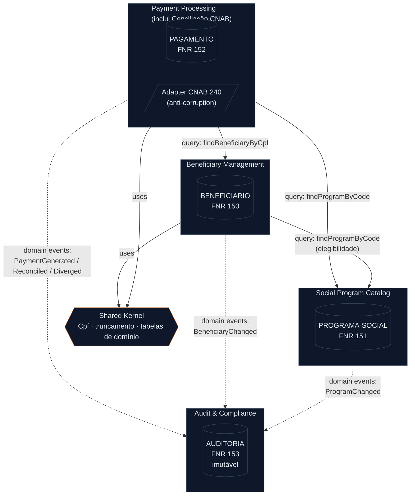

<!-- markdownlint-disable MD013 MD025 MD026 MD028 MD029 MD033 MD034 MD040 MD051 MD060 -->

# Mapa de Bounded Contexts — SIFAP Moderno

  

> 🗺 **Você está aqui:** [Kit PT-BR](../README.md) → [Estágio 2](README.md) → **bounded-contexts**

> **Produzido por** `@architect` no início do Estágio 2, fundamentado nas descobertas do Estágio 1.
> **Alvo arquitetural:** Modular Monolith (uma unidade implantável, fronteiras internas de módulo claras). Comunicação inter-context é **in-process** — não há HTTP entre serviços.

---

## Procedência das Hipóteses

> [!IMPORTANT]
> O [`discovery-report.md`](../01-arqueologia/discovery-report.md) está como **template não preenchido** — não contém uma seção formal de "hipóteses de recorte". Para não fabricar contexto de negócio, as hipóteses abaixo foram **derivadas diretamente das evidências reais** já catalogadas no Estágio 1:
>
> - **Clusters funcionais** dos subgraphs do [`dependency-map.md`](../01-arqueologia/dependency-map.md) (`Batch`, `Cadastro`, `Cálculo`, `Consulta/Relatório`, `Validação`).
> - **Ownership de dados** dos 4 DDMs Adabas: `BENEFICIARIO` (FNR 150), `PROGRAMA-SOCIAL` (FNR 151), `PAGAMENTO` (FNR 152), `AUDITORIA` (FNR 153).
> - **Regras de negócio** do [`business-rules-catalog.md`](../01-arqueologia/business-rules-catalog.md) (blocos BP-*, CD-*, BC-*, BRL-*).
>
> Quando o time preencher o discovery report com hipóteses explícitas, esta avaliação deve ser revisitada.

### Achado estrutural que orienta o recorte

O Estágio 1 provou que **não há uma única instrução `CALLNAT`/`INCLUDE`** nos 15 programas: cada `.NSN` é um silo compilado isoladamente. **Todo acoplamento é indireto, via arquivos Adabas compartilhados** (stamp coupling). Consequência para o recorte: **seguimos o dado, não a chamada.** A propriedade exclusiva de cada DDM é o sinal mais forte de fronteira de contexto.

Hubs de dados (pontos de acoplamento mais críticos):

- `PAGAMENTO` — tocado por 8 programas (BATCHPGT, BATCHCON, BATCHREL, CALCBENF, CALCCORR, CALCDSCT, CONSBENF, RELPGT).
- `BENEFICIARIO` — tocado por 8 programas (BATCHPGT, BATCHREL, CADBENEF, CADDEPEND, CALCBENF, CALCDSCT, CONSBENF, VALELEG).

Quem **escreve** em cada arquivo (impacto de mudança):

| Arquivo Adabas | Escritores (STORE/UPDATE) | Leitores notáveis |
| -------------- | ------------------------- | ----------------- |
| `BENEFICIARIO` | CADBENEF, CADDEPEND | BATCHPGT, BATCHREL, CALCBENF, CALCDSCT, CONSBENF, VALELEG, RELPGT |
| `PROGRAMA-SOCIAL` | CADPROG | BATCHPGT, CALCBENF, VALELEG |
| `PAGAMENTO` | BATCHPGT, CALCBENF (STORE); BATCHCON, CALCCORR, CALCDSCT (UPDATE) | BATCHREL, CONSBENF, RELPGT |
| `AUDITORIA` | BATCHCON (STORE) | RELAUDIT |

---

## Critérios de Avaliação

Cada hipótese é pontuada **High / Medium / Low** em três critérios:

| Critério | Pergunta | Sinal de fronteira forte | Evidência usada |
| -------- | -------- | ------------------------ | --------------- |
| **Coesão** | As regras deste grupo pertencem à mesma capacidade de negócio? | High = um único aggregate/capacidade | `business-rules-catalog.md` |
| **Acoplamento** | Quantas dependências cruzam a fronteira? | Low = poucos acessos a dados de outro contexto | `dependency-map.md` (arestas programa→dado) |
| **Frequência de mudança** | No legado, estes programas eram alterados juntos? | High (juntos) = mesmo contexto | datas de alteração nos DDMs + famílias de nome + duplicação de lógica |

> Como **não há grafo de chamadas**, a "frequência de mudança conjunta" usa como proxies: famílias de nome (`CALC*`, `CAD*`, `VAL*`), duplicação de lógica observada e o arquivo Adabas escrito em comum.

---

## Avaliação de Hipóteses

### H1 · Cadastro (CADBENEF + CADDEPEND + CADPROG) — REJEITADA (split)

| Critério | Nota | Justificativa |
| -------- | ---- | ------------- |
| Coesão | **Low** | Mistura **dois aggregates distintos**: pessoa (`BENEFICIARIO`) e catálogo de programa (`PROGRAMA-SOCIAL`). São capacidades de negócio diferentes. |
| Acoplamento | **Low** | CADBENEF/CADDEPEND só tocam `BENEFICIARIO`; CADPROG só toca `PROGRAMA-SOCIAL`. Não há acoplamento de dados entre eles. |
| Freq. mudança | **Low** | Beneficiários e dependentes mudam com altíssima frequência (operação diária); o catálogo de programas muda raramente (decisão de política pública). |

**Recomendação:** **dividir** em dois contextos — `Beneficiary Management` e `Social Program Catalog`. O agrupamento "Cadastro" é uma categoria de **camada técnica** (telas de CRUD), não uma capacidade de negócio.

### H2 · Cálculo + Ciclo de Pagamento (CALCBENF + CALCCORR + CALCDSCT + BATCHPGT) — ACEITA

| Critério | Nota | Justificativa |
| -------- | ---- | ------------- |
| Coesão | **High** | Todos giram em torno de **calcular e materializar o valor de um pagamento**: cálculo do benefício (BP-06..15, CALCBENF), correção monetária (CALCCORR/IPCA), descontos (CD-01..10). Uma única capacidade: processar pagamento. |
| Acoplamento | **Low** (interno) | Todos os 4 **escrevem `PAGAMENTO`** (STORE/UPDATE). Leem `BENEFICIARIO`/`PROGRAMA-SOCIAL` apenas como insumo (read-only). O dado de escrita é exclusivo do contexto. |
| Freq. mudança | **High** | Mudam juntos: a fórmula de benefício é **duplicada** entre BATCHPGT (inline) e CALCBENF (M-BP-01); descontos e correção compartilham o mesmo registro. Alterar a regra financeira toca todos. |

**Recomendação:** **aceitar** como `Payment Processing`. É o coração financeiro do sistema e o dono exclusivo de `PAGAMENTO`.

### H3 · Consulta / Relatório (CONSBENF + RELPGT + RELAUDIT + BATCHREL) — REJEITADA (distribuir)

| Critério | Nota | Justificativa |
| -------- | ---- | ------------- |
| Coesão | **Low** | "Relatório" é um **estilo técnico de saída**, não uma capacidade. RELAUDIT lê auditoria; RELPGT/BATCHREL leem pagamentos; CONSBENF consulta beneficiário. Domínios diferentes. |
| Acoplamento | **High** | Lê **todos** os 4 arquivos. Concentrar leitura aqui criaria um contexto que depende de todos os outros — fronteira no lugar errado. |
| Freq. mudança | **Low** (entre si) | Um relatório de auditoria e um relatório de pagamento não mudam pela mesma razão. |

**Recomendação:** **rejeitar** o agrupamento. Cada consulta/relatório acompanha o contexto **dono do dado que lê**: CONSBENF → Beneficiary Management; RELPGT e BATCHREL → Payment Processing; RELAUDIT → Audit & Compliance.

### H4 · Validação (VALBENEF + VALDOCS + VALELEG) — REJEITADA (shared kernel + absorção)

| Critério | Nota | Justificativa |
| -------- | ---- | ------------- |
| Coesão | **Medium** | É lógica de validação genuína, mas heterogênea: CPF (mod-11), documentos, e elegibilidade (regra de negócio sobre beneficiário+programa). |
| Acoplamento | **Medium** | VALELEG lê `BENEFICIARIO` **e** `PROGRAMA-SOCIAL`. VALBENEF/VALDOCS não acessam dados (validação em memória). |
| Freq. mudança | **Low/órfã** | Os três são **órfãos** — nenhum `CALLNAT` os invoca. CPF mod-11 está **triplicado** (VALIDA-CPF, VALIDA-CPF-COMPLETO, VALIDA-CPF-DOC). |

**Recomendação:** **não** é um contexto. Quebrar em: (a) validação de CPF/documentos → **Shared Kernel** (tipo `Cpf` autovalidante, elimina a tripla duplicação); (b) elegibilidade (VALELEG) → **Beneficiary Management** (é regra sobre a pessoa, consulta o catálogo de programa via porta). ⚠️ A validação legada **não roda** hoje (M órfão) — o sistema moderno deve **ativá-la** na fronteira de escrita.

### H5 · Conciliação Bancária (BATCHCON) — MESCLADA em Payment Processing

| Critério | Nota | Justificativa |
| -------- | ---- | ------------- |
| Coesão | **High** | Capacidade nítida: casar pagamento do SIFAP com retorno bancário CNAB 240 (BC-01..18) e atualizar status. |
| Acoplamento | **Medium** | **Atualiza `PAGAMENTO`** (status pós-banco, BC-10..13) — dado pertencente a Payment Processing — e **escreve `AUDITORIA`** (BC-15/16). Toca dois donos. |
| Freq. mudança | **Medium** | Muda por mudança de layout bancário (integração externa), eixo diferente do cálculo. |

**Recomendação:** **mesclar** como **módulo de reconciliação dentro de `Payment Processing`** (é quem possui `PAGAMENTO` e seu ciclo de status). A escrita em `AUDITORIA` vira **emissão de domain events** para o contexto de Audit, não acesso direto à tabela. Coesão alta + ownership do status decidem a favor do merge; o adaptador CNAB fica isolado como porta de integração.

### H6 · Auditoria (AUDITORIA + RELAUDIT) — ACEITA

| Critério | Nota | Justificativa |
| -------- | ---- | ------------- |
| Coesão | **High** | Trilha de auditoria imutável — capacidade própria, com obrigação legal explícita (IN-TCU 63/2010, retenção mínima 10 anos, Art. 14 Lei 8159). |
| Acoplamento | **Low** | `AUDITORIA` é escrito por **um único** programa hoje (BATCHCON) e lido por RELAUDIT. Recebe dados; não depende da lógica de ninguém. |
| Freq. mudança | **Low** | DDM marca o arquivo como imutável (sem UPDATE/DELETE, "não reorganizar"). Ciclo de vida e retenção totalmente distintos dos demais. |

**Recomendação:** **aceitar** como `Audit & Compliance`. Restrições legais e imutabilidade justificam uma fronteira dedicada. ⚠️ Corrigir no moderno o achado de que RELAUDIT **suprime eventos `EX`** (exclusão) do relatório — a trilha não pode esconder deleções.

---

## Bounded Contexts Finais

> 4 bounded contexts + 1 Shared Kernel. Nomes em linguagem de negócio.

### 1 · Beneficiary Management

- **Responsabilidade:** Possui o ciclo de vida do beneficiário e de seus dependentes — cadastro, alteração, manutenção de status (`A` ativo, `E` excluído), renda familiar, região e dados que alimentam a elegibilidade. É a fonte única de verdade sobre "quem é a pessoa". Inclui a **avaliação de elegibilidade** (VALELEG) e ativa as validações de CPF/documento na fronteira de escrita (hoje órfãs no legado).
- **Dados próprios (DDMs/tabelas):** `BENEFICIARIO` (FNR 150) — incluindo dependentes (provável grupo PE no Adabas).
- **Interface pública:**
  - `findBeneficiaryByCpf(cpf) : BeneficiarySnapshot` — read; retorna status, região, renda familiar, data de nascimento, nº de dependentes (DTO, não a entidade).
  - `assessEligibility(cpf, programCode) : EligibilityResult` — regra VALELEG.
  - emite eventos `BeneficiaryRegistered`, `BeneficiaryChanged(before, after)`, `DependentChanged`.
- **Por que é contexto próprio:** dono exclusivo de `BENEFICIARIO`, capacidade coesa, e frequência de mudança (diária) distinta do catálogo de programas e do motor financeiro.

### 2 · Social Program Catalog

- **Responsabilidade:** Mantém o catálogo de programas sociais — código, tipo (`A` = abono natalino aplicável), status (`A` ativo), valor base e fator de reajuste. Muda por decisão de política pública, raramente.
- **Dados próprios (DDMs/tabelas):** `PROGRAMA-SOCIAL` (FNR 151).
- **Interface pública:**
  - `findProgramByCode(code) : ProgramSnapshot` — read; retorna status, tipo, valor base, fator de reajuste.
  - emite eventos `ProgramRegistered`, `ProgramChanged`.
- **Por que é contexto próprio:** ownership exclusivo de `PROGRAMA-SOCIAL`, baixíssimo acoplamento com cadastro de pessoas, e frequência de mudança muito menor que Beneficiary Management (motivo do split de H1).

### 3 · Payment Processing

- **Responsabilidade:** Núcleo financeiro. Possui o ciclo de vida do pagamento: cálculo do benefício (fatores regional/familiar/renda/idade, 13º e abono de dezembro), correção monetária (IPCA), aplicação de descontos com teto de 30% e exceção judicial (`J`), o ciclo mensal batch, e a **conciliação bancária** (CNAB 240) que atualiza o status do pagamento (`G/P/C/D/E`). Dono único da máquina de estados do pagamento.
- **Dados próprios (DDMs/tabelas):** `PAGAMENTO` (FNR 152).
- **Interface pública:**
  - `runMonthlyCycle(competencia) : CycleResult` — gera pagamentos do mês (BATCHPGT).
  - `calculateBenefit(cpf, competencia) : Payment` · `applyMonetaryCorrection(...)` · `applyDiscounts(paymentId)`.
  - `reconcile(bankReturnFile) : ReconciliationResult` — módulo de conciliação (BATCHCON).
  - relatórios de pagamento (RELPGT, BATCHREL).
  - emite eventos `PaymentGenerated`, `PaymentReconciled`, `PaymentDiverged`, `PaymentStatusChanged`.
- **Por que é contexto próprio:** alta coesão em torno de "processar pagamento", dono exclusivo de `PAGAMENTO` (escrita), e os programas mudam juntos (fórmula duplicada inline/online — M-BP-01). Conciliação foi **mesclada** aqui (H5) por possuir o status do pagamento.

### 4 · Audit & Compliance

- **Responsabilidade:** Mantém a trilha de auditoria **imutável** exigida por lei (IN-TCU 63/2010; retenção mínima 10 anos, Art. 14 Lei 8159). Registra incluir/alterar/excluir/conciliar/divergir com estado antes/depois, usuário e origem. Não permite UPDATE/DELETE. Produz relatórios de auditoria — **sem suprimir** eventos de exclusão (corrige o achado do legado em RELAUDIT).
- **Dados próprios (DDMs/tabelas):** `AUDITORIA` (FNR 153).
- **Interface pública:**
  - `record(AuditEvent)` — append-only; consumido a partir de domain events dos outros contextos.
  - `queryAuditTrail(filters) : AuditPage` — leitura para RELAUDIT, **incluindo** ações `EX`.
- **Por que é contexto próprio:** obrigação legal, imutabilidade e ciclo de vida/retenção totalmente distintos. Baixo acoplamento — apenas recebe eventos.

### Shared Kernel (módulo compartilhado — **não** é um bounded context)

- **Conteúdo:** tipo `Cpf` autovalidante (algoritmo mod-11, unifica VALIDA-CPF / VALIDA-CPF-COMPLETO / VALIDA-CPF-DOC), utilitário de truncamento monetário (truncar 2 casas, padrão RN-014 — **não** arredondar), e tabelas de domínio confirmadas (códigos de status do pagamento, tipos de desconto, códigos de região).
- **Uso:** importado por Beneficiary Management e Payment Processing.
- **Atenção:** o significado de vários códigos é **mistério aberto** no Estágio 1 (status `P` = pago vs. pendente — M-BC-01; tipos de desconto letra vs. número — M-CD-01). Estes domínios só entram no Shared Kernel **após** confirmação (`/speckit.clarify`).

---

## Comunicação Inter-Context

> Modular Monolith: toda comunicação é **in-process**. Leituras = chamada de método via interface (porta). Notificações de mudança = **domain events** (desacoplam o produtor do consumidor de auditoria).

| De → Para | Direção | Mecanismo | Dados trocados |
| --------- | ------- | --------- | -------------- |
| Payment Processing → Beneficiary Management | unidirecional | Chamada de método via porta `BeneficiaryQueryPort` | `cpf` → `BeneficiarySnapshot` (status, região, renda, nascimento, nº dependentes). Somente DTO read-only. |
| Payment Processing → Social Program Catalog | unidirecional | Chamada de método via porta `SocialProgramQueryPort` | `programCode` → `ProgramSnapshot` (status, tipo, valor base, fator reajuste). DTO read-only. |
| Beneficiary Management → Social Program Catalog | unidirecional | Chamada de método via porta `SocialProgramQueryPort` | `assessEligibility` precisa do programa; consulta por código. DTO read-only. |
| Payment Processing → Audit & Compliance | unidirecional | **Domain events** | `PaymentGenerated`, `PaymentReconciled`, `PaymentDiverged` (valor antes/depois), `PaymentStatusChanged`. |
| Beneficiary Management → Audit & Compliance | unidirecional | **Domain events** | `BeneficiaryRegistered`, `BeneficiaryChanged(before, after)`. |
| Social Program Catalog → Audit & Compliance | unidirecional | **Domain events** | `ProgramRegistered`, `ProgramChanged`. |
| Beneficiary Management / Payment Processing → Shared Kernel | dependência | Importação de tipo (in-process) | `Cpf`, truncamento monetário, tabelas de domínio. |

**Regras de fronteira:**

- Nenhum contexto lê/escreve a tabela de outro contexto diretamente — só pela porta pública ou por evento.
- A conciliação **não** escreve `AUDITORIA`: emite evento para Audit & Compliance (anti-corruption no adaptador CNAB).
- O **anti-corruption layer** do adaptador CNAB 240 isola o layout bancário posicional (BC-02..05) do modelo de domínio.
- A **ordem de execução implícita** do legado (cálculo → correção → desconto → conciliação) fica **explícita e interna** ao Payment Processing, eliminando o risco de corrida apontado no dependency map.

---

## Diagrama Mermaid do Mapa de Contexto

> Linha cheia = chamada de método in-process (read, síncrona). Linha tracejada = domain event (assíncrono lógico, desacoplado).

---

## Definição de Pronto — checklist

- [x] Toda hipótese derivada do Estágio 1 avaliada contra os três critérios (H1–H6).
- [x] Hipóteses rejeitadas com raciocínio documentado (H1 split, H3 distribuir, H4 shared kernel, H5 merge).
- [x] 4 bounded contexts finalizados com nomes em linguagem de negócio + 1 Shared Kernel.
- [x] Cada contexto tem responsabilidade, dados próprios e esboço de interface pública.
- [x] Diagrama Mermaid de context map com relacionamentos.
- [x] Nenhum contexto isolado — todos têm caminhos de comunicação definidos.

## Decisão Pendente do Time

> [!NOTE]
> Esta análise é a **recomendação** do `@architect`. O time toma a decisão final. Pontos abertos para validar:
>
> 1. **Conciliação como módulo de Payment Processing** (H5) vs. contexto próprio — aceita o merge?
> 2. **Social Program Catalog separado** de Beneficiary Management (H1 split) — ou mantém junto por simplicidade inicial?
> 3. Códigos de domínio em mistério (status `P`, tipos de desconto) precisam de `/speckit.clarify` antes de entrarem no Shared Kernel.
>
> Se o time sobrescrever alguma recomendação, registre aqui o raciocínio.
